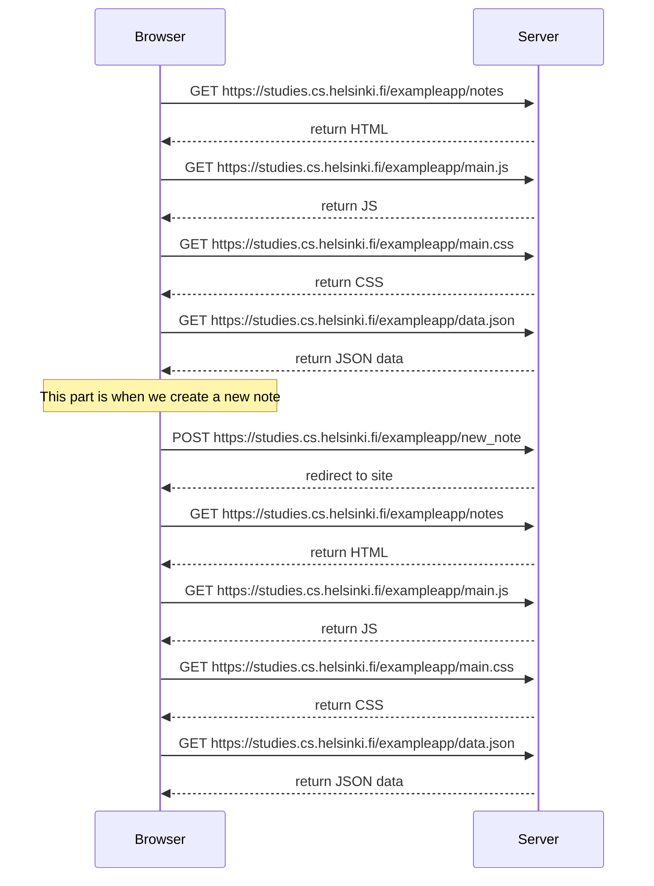

```mermaid

sequenceDiagram
  participant Browser as Browser
  participant Server as Server

  Browser ->>+ Server: GET https://studies.cs.helsinki.fi/exampleapp/notes
  Server -->> Browser: return HTML
  Browser ->>+ Server: GET https://studies.cs.helsinki.fi/exampleapp/main.js
  Server -->> Browser: return JS
  Browser ->>+ Server: GET https://studies.cs.helsinki.fi/exampleapp/main.css
  Server -->> Browser: return CSS
  Browser ->>+ Server: GET https://studies.cs.helsinki.fi/exampleapp/data.json
  Server -->> Browser: return JSON data

  Note over Browser: This part is when we create a new note

  Browser ->>+ Server: POST https://studies.cs.helsinki.fi/exampleapp/new_note
  Server -->> Browser: redirect to site
  Browser ->>+ Server: GET https://studies.cs.helsinki.fi/exampleapp/notes
  Server -->> Browser: return HTML
  Browser ->>+ Server: GET https://studies.cs.helsinki.fi/exampleapp/main.js
  Server -->> Browser: return JS
  Browser ->>+ Server: GET https://studies.cs.helsinki.fi/exampleapp/main.css
  Server -->> Browser: return CSS
  Browser ->>+ Server: GET https://studies.cs.helsinki.fi/exampleapp/data.json
  Server -->> Browser: return JSON data

```
