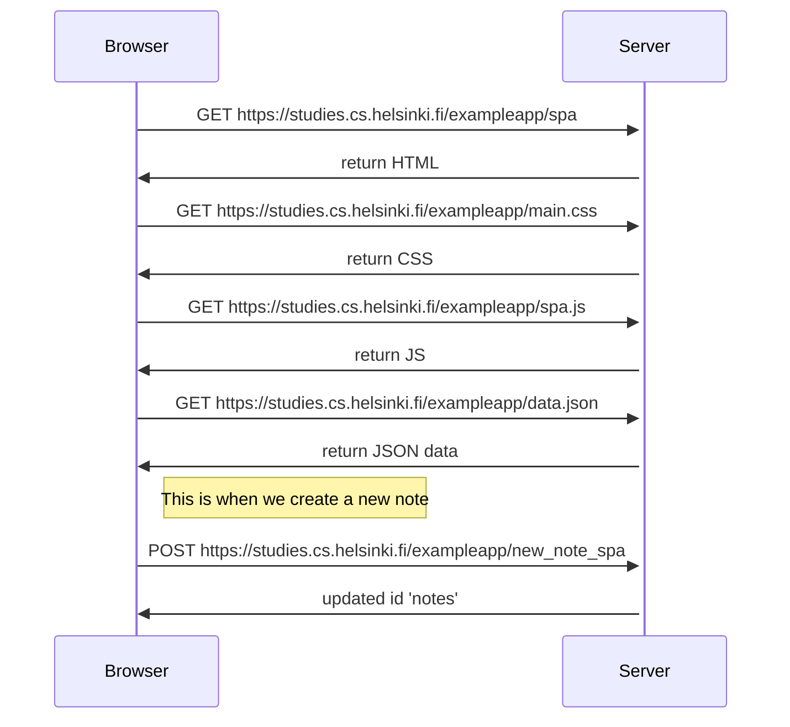

```mermaid
sequenceDiagram
  participant Browser as Browser
  participant Server as Server

Browser ->>+ Server: GET https://studies.cs.helsinki.fi/exampleapp/spa
Server ->> Browser: return HTML
Browser ->>+ Server: GET https://studies.cs.helsinki.fi/exampleapp/main.css
Server ->> Browser: return CSS
Browser ->>+ Server: GET https://studies.cs.helsinki.fi/exampleapp/spa.js
Server ->> Browser: return JS
Browser ->>+ Server: GET https://studies.cs.helsinki.fi/exampleapp/data.json
Server ->> Browser: return JSON data
Note right of Browser: This is when we create a new note
Browser ->>+ Server: POST https://studies.cs.helsinki.fi/exampleapp/new_note_spa
Server ->> Browser: updated id 'notes'
```
